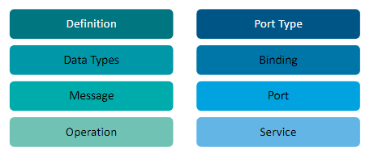
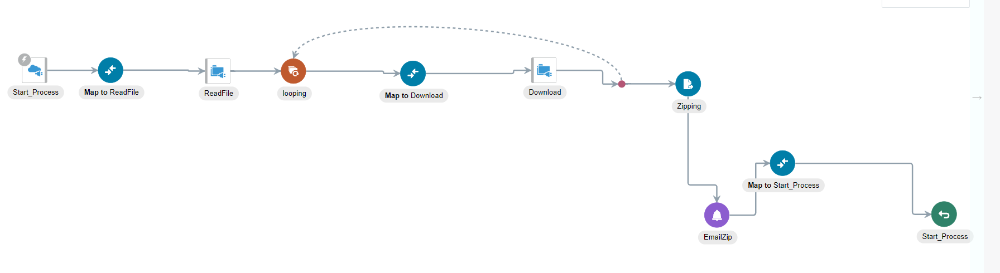

# Oracle Integration Cloud (OIC)

## Table of Contents :

### Scenarios

<table border="1">
  <tr>
    <td>Hello World</td>
  </tr>
  <tr>
    <td>Calling BI Publisher Report (opaque)</td>
  </tr>
  <tr>
    <td>Calling BI Publisher Report (decode function)</td>
  </tr>
  <tr>
    <td>Calling BI Publisher Report with parameter</td>
  </tr>
  <tr>
    <td>Write to FTP</td>
  </tr>
  <tr>
    <td>Read from FTP</td>
  </tr>
  <tr>
    <td>Create an Invoice</td>
  </tr>
  <tr>
    <td>Create an Invoice and Attach a file</td>
  </tr>
  <tr>
    <td>Fault Handlers</td>
  </tr>
  <tr>
    <td>List Files in FTP</td>
  </tr>
  <tr>
    <td>Move Files in FTP</td>
  </tr>
  <tr>
    <td>Download from FTP, ZIP and Send email</td>
  </tr>
  <tr>
    <td>Insert Data to DB</td>
  </tr>
  <tr>
    <td>Retrieve data from DB and Write to FTP</td>
  </tr>
  <tr>
    <td>Invoke a Stored Procedure</td>
  </tr>
  <tr>
    <td>Invoke a Function</td>
  </tr>
  <tr>
    <td>Calling an ESS Job</td>
  </tr>
  <tr>
    <td>FBDI</td>
  </tr>
  <tr>
    <td>Migration</td>
  </tr>
</table>

### Adapters & Integration Elements

<table border="1">
  <tr>
    <td>SOAP</td>
  </tr>
  <tr>
    <td>REST</td>
  </tr>
  <tr>
    <td>FTP</td>
  </tr>
  <tr>
    <td>Oracle DB</td>
  </tr>
  <tr>
    <td>ERP Cloud Adapter</td>
  </tr>
  <tr>
    <td>Actions</td>
  </tr>
  <tr>
    <td>Assign</td>
  </tr>
  <tr>
    <td>SOAP</td>
  </tr>
  <tr>
    <td>REST</td>
  </tr>
  <tr>
    <td>Switch</td>
  </tr>
  <tr>
    <td>Scope</td>
  </tr>
  <tr>
    <td>DB</td>
  </tr>
  <tr>
    <td>For each</td>
  </tr>
  <tr>
    <td>While</td>
  </tr>
  <tr>
    <td>Stage File</td>
  </tr>
  <tr>
    <td>Logger</td>
  </tr>
  <tr>
    <td>Notification</td>
  </tr>
  <tr>
    <td>ERP Cloud</td>
  </tr>
  <tr>
    <td>FTP</td>
  </tr>
  <tr>
    <td>Wait</td>
  </tr>
  <tr>
    <td>Throw new fault</td>
  </tr>
  <tr>
    <td>Map</td>
  </tr>
</table>

### Integrations

<table border="1">
  <tr>
    <td>App Driven</td>
  </tr>
  <tr>
    <td>Scheduled</td>
  </tr>
</table>

## Oracle Integration Cloud (OIC)

1. Integrating applications(databases or other ERP Systems/Modules)

2. Used to connect various application in cloud & on-premise.

3. Native connectivity to oracle SaaS applications.

## Why we use OIC ?

- Used to connect different applications and systems within a business which help them to sharing data,automating processes,managing the dependecies of different processes.

- Widely used for developing and maintaining ERP Systems.

## Web Services

- Used for standardizing messaging protocol which are used in communicating between web-applications

  - Cross platform interactions
  - data transactions
  - protocoled systematic storage of data

- Types of Web Services :

### 1. XML-RPC : Extensive Markup Language Remote Procedure Calling

- Simple Web service
- XML-RPC uses the HTTP protocol to pass information from a client computer to a server computer.
- Used to call procedures from one machine to another machine.
- majorly used for testing applications
- XML-RPC parameters are a simple list of types and content - structs and arrays are the most complex types available.
- Not used for enterprise level

```xml
   mass=getMass(objectID)
```

### 2. SOAP : Simple Object Access Protocol

- It is a `Network protocol` used for exchanging structured data between nodes
- Uses XML Format to transfer & Store data/Message.
- SOAP is a light weight data interchange protocol because it is based on XML.
- SOAP was designed to be OS and Platform independent.
- It works in Decentralized & Distributed application environment.
- It is majorly used for calling objects.

```xml
POST /StockQuote HTTP/1.1 *HTTP Method to send data to the server*
Host: www.stockquoteserver.com *Specifies the Domain name of the Server*
Content-Type: text/xml; *Type of data*
charset="utf-8" *Encoding Standards*
Content-Length: nnnn *Length of the Content*
SOAPAction: "Some-URI " *Place Actual URI (UNIQUE RESOURCE IDENTIFIER)*

<?xml version="1.0"?>
<SOAP-ENV:Envelope
  xmlns:SOAP-ENV="http://schemas.xmlsoap.org/soap/envelope/"
  SOAP-ENV:encodingStyle="http://schemas.xmlsoap.org/soap/encoding/">
  <SOAP-ENV:Body>
    <m:GetLastTradePrice xmlns:m="Some-URI">
      <symbol>DIS</symbol>
    </m:GetLastTradePrice>
  </SOAP-ENV:Body>
</SOAP-ENV:Envelope>
```

### 3. Web Services Description Language (WSDL) :

- A WSDL definition is divided into separate sections that specify the logical interface and the physical details of a web service.
- The physical details include both endpoint information, such as HTTP port number, and binding information, which specifies how the SOAP payload is represented and which transport is used.
- The general structure of WSDL consists of Definition, target namespace, Datatypes, Messages, Port-type, Bindings, and services.

- Widely used as an XML-based protocol that exchanges data and information in distributed systems.
- It works in combination of both SOAP & UDDI (Universal Description Discovery & Integration).
- WDSL have operations :
  1.  One-Way : Here Operation can recieve message but cannot return reposnse for it.
  2.  Request-Response : Here for any recieving message a return is also there.
  3.  Solicit-Response : Here we send request and wait for the repsonse.

<br>



1. Defination :
   - Root of all WSDL documents.
   - Defines the name of the web-service.

```c
<definitions name="ServiceName" targetNamespace="http://example.com/service" xmlns="http://schemas.xmlsoap.org/wsdl/" xmlns:tns="http://example.com/service" xmlns:xsd="http://www.w3.org/2001/XMLSchema" xmlns:soap="http://schemas.xmlsoap.org/wsdl/soap/">

- Giving the service name.
- Providing the target-namespace of the xsdl work
- Providing pre-fixed name-space
```

2. Data Types :
   - Service has input and output with the service mapping.
   - This is can be shared between the `Sender` & `Reciever`.

```c
 <types>
        <!-- XML Schema definitions -->
        all the element definations
 </types>
```

3. Message
   - It describes the data exchange between the publisher and consumer
   - Contains two components :
     1. `INPUT`
     2. `OUTPUT`

```c
 <message name="InputMessage">
        <part name="parameters" element="tns:InputElement"/>
</message>
   // Multiple Message and diff parameters can be attached.
<message name="OutputMessage">
        <part name="parameters" element="tns:OutputElement"/>
</message>
```

4. Port Type :
   - Multiple Reposnse/Requests are combined can also pass input.
   - Mostly used in SOAP Services.

```c
 <portType name="ServicePortType">
        <operation name="OperationName">
            <input message="tns:InputMessage"/>
            <output message="tns:OutputMessage"/>
        </operation>
    </portType>

- Using pre-defined port.
- defining an operation.
```

5. Binding Element :
   - Specifies the transmission details of port type operation.
   - Providing port type operations like HTTPS,GET,PUSH,PUT etc.
   - Contains two elements :
     1. Name
     2. Port Type

```c
<binding name="ServiceBinding" type="tns:ServicePortType">

1. Build In extension for SOAP
2. SOAP:BINDING (building Connection)
3. SOAP:OPERATION (Contains SOAP elements)
4. SOAP:BODY (Contains Messages)
```

6. Service
   - Specify a port.
   - Includes a <Document> element refering human reading content.

```c
<service name="ServiceName">
    <port name="ServicePort" binding="tns:ServiceBinding">
        <soap:address location="http://example.com/service"/>
    </port>
</service>
```

### 4. Representation State Transfer (RestFul) :

- Rest is an `Architectural style` and uses java-API services.

- It works on HTTP & SOAP Webservices
- It uses URI (Uniform Resource Identifier) objects.
- It is stateless web-service.
- Rest supports data formats as txt,xml,HTML,JSON etc.
- RESTful web services support caching, which is the process of storing some responses
- Methods :
  - GET
  - POST
  - PATCH
  - DELETE
  - PUT

## What is XML ?

- XML : Extensible Markup Language
- Designed to provide,store information in various data formats.
- Here we can define tags unlike pre-defined tags in html.
- HTML defines presentation of the content but XML defines the content itself.

```xml
<Library>

<Book>
   <Genre> Suspense,Thriller </Genre>
   <Title> Once in Hardshell </Title>
   <Author>JK Rowling</Author>
   <Publisher> .. </Publisher>
   <Published-Date> .. </Published-Date>
</Book>

<Book>
   <Genre> Horror</Genre>
   <Title> IT </Title>
   <Author> .. </Author>
   <Publisher> .. </Publisher>
   <Published-Date> .. </Published-Date>
</Book>

<Book>
   <Genre> Fictional </Genre>
   <Title> Iron Man 3 </Title>
   <Author>Stan Lee</Author>
   <Publisher> .. </Publisher>
   <Published-Date> .. </Published-Date>
</Book>

<Library>
```

### XML NOTATIONS

### 1. XML Declaration

```xml
<?xml version:"1.0" ?>
```

### 2. Processing Instruction

```xml
<?xml-stylesheet type="text/xsl" href ="stye.xsl"?>
```

### 3. Comments

```xml
<!-- File : String
     Author : String
     Publisher : String
     PublishingDate : Date
-->
```

### 4. Root Element or Tag

1. In above example `<Library>` is a root tag.

2. It is like a `Tree` Stucture of many `Parent Nodes` Nested and lastly `Leave Nodes`.

3. The Value/Data inside the Tags is called `Attribute`.

### 5. Components of XML :

1. Elements (Root,Nodes,Leaves).
2. Attributes (Data)
3. Processing Instructions (Declarations,Namespaces,Schema Declaration).

## What is XSD ?

- It stores the structure of an xml
- Consists of data types,variables,constraints.

```xsd
<xs:schema xmlns:xs="http://www.w3.org/2001/XMLSchema"> *Root Element Config*
    <xs:element name="book"> *Base Element*
        <xs:complexType> *Specifying the collection of different elements*
            <xs:sequence>
                <xs:element name="title" type="xs:string"/> *Child Element 1*
                <xs:element name="author" type="xs:string"/> *Child Element 2*
                <xs:element name="year" type="xs:int"/> *Child Element 3*
            </xs:sequence>
        </xs:complexType>
    </xs:element>
</xs:schema>
```

<br>

---

<br>

## Integration Styles in OIC :

### 1. App Driven Orchestration

- Multi-step integration flow invoking applications,integrations and trigged processes by application or API.

- Creates `Business Objects` or `App driven Orchestrtaion Integration`.
- Differnt ways how the tasks are performed different ways in which tasks or operations are executed and managed within a workflow
  - Synchronous
  - Asynchronous
  - Fire or Forget type.
- Trigger type connection (kind of connection that initiates or starts a workflow) can be invoked by API or Application.

### 2. Scheduled Orchestration

- Muti-step integration work flow invoking applications,integrations and bulk/batch triggered processes or file processing.

- Defining the schedule and frequency of such iterations.

- Upon integration unique URL is created.(Our SaaS instance with the URI that we provide)

### 3. File Transfer

- Move file across the `Network`.
- Create an Integration to transfer files.

### 4. Basic Routing --- depricated

- Basic app-to-app routing with data mapping.

- Create an integration that provides a template with empty trigger event which invokes.

- We cannot multiple routing expressions.

### 5. Publish to OIC --- depricated

- Here there is a channel for pub/sub where one publishes something and another integration subscribes it.

- Create an integration to publish message to OIC channel.

- Add a Trigger Adapter

- Publisher & Subscribers options can be activated/deactivated independently.

### 6. Subscribe to OIC --- depricated

- It takes input from the publisher/subscriber channel and perform tasks/integration process.

- Add a invoke adapter.

- Here a publisher is neccessary so that the subscriber can take input.

### Integration Development & Management Workflow :


### What are Look-Ups ?

- Used for storing and using & mapping values at a centralized point.

- Global to OIC can be used in various system at same instance of time.

---

## OIC Adapaters

### What are adapters ?

-> An adapter is a program that allows connectivity & controls the information transfer between user and cloud environment.

-> Adapters are predefined code which can be used directly.

-> Acts as a path/mediator between different oracle applications & also third-party applications.

-> Supports extensive integration types.

-> Abstracts the protocol & transport complexities.

-> Assigning the application assets(Ip addresses,ports,URL information and all Internet network detailing).

-> Supports std & custom objects.

-> Adapter can be configured in Integration flow.

### Creating a Connection :

1. Creating a connection we require only basic information,defined connection & security policies.

2. Multiple `Runtime` Connection are managed by OIC for each integration.


3. Connections are used for 2 roles :

- Trigger (In-Bound)
  - Defines SOAP or REST interface which helps to invoke an `INTEGRATION FLOW`.
  - Allows to define a SOAP interface for SaaS application.
  - Allows polling trigger to consume a file or message from upstream system so that we can process that.
- Invoke (Out-Bound)
  - Used to define an external service or integration which can be called from an integration.


### Types of OIC Adapters :

1. Technology Adapters :

### SOAP

- Used for external SOAP application program interface in OIC.
- Passing a message received from Oracle Integration Cloud (OIC) to an external SOAP endpoint involves receiving the message, transforming or mapping the data, configuring the SOAP connection, invoking the SOAP service, and handling the response.
- We can config SOAP adapter as both `TRIGGER` or `INVOKE` connection.

<table border="2">
  <tr>
    <th>Feature/Capability</th>
    <th>SOAP Adapter as Trigger Connection</th>
    <th>SOAP Adapter as Invoke Connection</th>
  </tr>
  <tr>
    <td><strong>Payload Size Constraints</strong></td>
    <td>Ensures that incoming structured payloads (XML) from a client do not exceed 50 MB in size</td>
    <td>Ensures that outgoing structured payloads (XML) don't exceed 50 MB in size</td>
  </tr>
  <tr>
    <td><strong>Protocol</strong></td>
    <td>Allows you to configure only HTTP protocol-based SOAP endpoints used for accepting incoming SOAP requests</td>
    <td>Allows the invocation of an HTTP protocol-based external SOAP endpoint and encrypts communications using Transport Layer Security (TLS)</td>
  </tr>
  <tr>
    <td><strong>Header Properties</strong></td>
    <td>Supports the access of both standard and custom SOAP/HTTP header properties</td>
    <td>Supports the access of both standard and custom SOAP/HTTP header properties</td>
  </tr>
</table>

### REST

- Can be configured as both `TRIGGER` & `INVOKE` connection.
  - Exposes integrations as REST API via configurations of a REST adapter connection Trigger.
  ```
  Example : Imagine I have an integration that processes customer orders. By using a REST adapter connection trigger, I can expose this integration as a REST API. Any external system can send an order to  itegrate by making a REST API call here when I integrate will receive the order process it and return a response.
  ```
- Here Rest adapter treats all endpoints as exposed.

- Can upload only xml files which doesn't belong to any NameSpace.

- Support for HTTP methods GET, PUT, POST, DELETE, and PATCH.

- Support for JSON, XML, binary (inline and unstructured), and URL-form-encoded payloads.

### Oracle ERP Cloud adapter

1. The adapter is used for building an integration with oracle ERP applications.

2. It easily integrates with SaaS and on-premise applications.

3. It produces simplified WSDL integration-centric files as an output.

4. It subscribes to business objects when we are configuring the adapter.

5. Automatically identifies the required catlog service WSDL

6. Dynamically invoke `Rest` endpoints or `URL` which any extra information to invoke connection or `REST` outbound.

### FTP Adapter

1. It integrates the service for remote file systems using FTP and SSH protocols.

2. It performs `READ` and `WRITE` operations using accessible servers in `Binary` or `ASCII` formats.

3. We can use `Connectivity Agent` when we are not working with publicly accessible server.

4. This `Connectivity Agent` helps in `Encrypting` and `Decrypting` the data that is passing.

5. It have multiple `Authentication Levels` :

   - Public Key
   - Host Key
   - Multi-Level Authentication

6. FTP doesn't support verification of `Signed File` (basic personal informational files).

7. In Oracle it doesn't support `IBM FTP Server`.

8. It uses ssh-kegen tool to generate SSH keys (Secure shell keys) in PEM (Privacy-Enhanced Mail) format to connect to on-premise SFTP server.

9. FTP `ONLY` supports homogenous `ARRAYS` (Elements contains in the array are of same data type) in Json format only

10. Does not support file processing by two or more
    integrations present in the same folder
    Restrictions.

### Database Adapter :

- This adapter is used to connectivity agent with on premise data-base and perform Database Operations (CRUDE) operations.

### Oracle Autonomous Transaction Processing (ATP) adapter

- It is a data base adapter which we use in OIC

- Here we use wallet to connect with the oracle applications for direct connectivity.

- It is primary used for performing data base operations and stored procedures.

- Allows Bulk data import operations :

  - Direct connectivity
  - Oracle ATP S Database
  - CSV data format only

- Supports non-JDBC (PL/SQL tables and records) in `Out-Bound`(Used for invoking procedures) Innvocation of stored procedures.

- Here Stored procedures are precompiled collections which are stored in database can be executed using this adapter.

- We can use DML sql queries (Insert,Update,Delete,Select)

- can insert or update multiple records in a single request.

---

## OIC Actions

### 1. Assign

- Used to assign values to variables using expression builder(used to create complex expression or formulas)

- Can be used in entire integration.

### 2. Stage File :

- Used to perform operations on files which are downloaded by `FTP Adapter`.

- Multiple Options :

  - Write
  - Read
  - Zip
  - Unzip
  - List of Files

- All operations are done on a specified particular location in Oracle Integration

### 3. Integration

- This action invokes an `Integration` from an `Orchestration Integration`. (Calling an Integration from an Integration).

- When you drag the integration node into the integration, you are prompted to invoke an active Integration.

### 4. Invoke

- Used to call another connection or integration or functionality.

### 5. Logger

- It is used to log meesage and variables in an activity stream at any point in the `Integration Flow`.

- We can static or variable populated log message (using concat operation of both normal text and variable reference).

### 6. Notification

- This action enables to send a mail or notification to single or multiple people.

### 7. B2B

- Used for processing EDI documents.

- Basically what it does converts the incoming EDI document into xml format and then do some processes and then again convert it into EDI document.

- Process like :

  1. Validating the XML message against predefined schemas.

  2. Transforming the data to match the requirements of the target system.

  3. Enriching the data by adding additional information from other sources.

  4. Routing the message to the appropriate endpoint or service.

### 8. JavaScript

- Add a javascript functionality/code/program in an integration.

- Invokes a javascript function in an `Integration Flow`.

- Can used in various scenarios like

  - Data Conditioning
  - Complex Calculations
  - Error handling
  - etc

### 9. Process

- Used to invoke a process in an `Integration`.

- Processes are basically other `Integrations`.

- Here we can store the `Output` of this Process in a variable which can be used in futher process in the work-flow.

### 10. Swicth

- Switch defines one or more branches of flow under some condition.

- Work like `If-Else` .

- Two parts :
  - True Branch (Where it satifies the condition and proceed with the flow).
  - False Branch (Where the condition is not satisfied)

### 11. For - Each

- Looping Statement.

- Perform iterations over a repeating element and
  executes one or more actions within the scope.

- Iterates until the condition is true/false.

### 12. Scope

- Manages a group of action

- Generally used in exception handling/fault handling.

- Have two components :

  - Normal Flow components
  - Default Components

- Elements defined in the scope are limited to the scope (like if assign action is used for intializing and creating an variable then the variable scope will be till the `SCOPE`).

### 13. While

- Looping Statement.

- Iterates over actions or invoke connection till a specific condition is meet.

- Have to provide condition.

### 14. Note

- Adds a place-holder just like a sticky note having refernce information.

### 15. Wait

- Delay execution of integration process by specified time period.

- Generally used for asynchronous process.

### 16. Throw New Fault

- Used for handling/catching exception produced in the intergration flow.

- Here we need to define condition under which it should catch-exception and throw to the end user.

- Generally used where interactions with other systems/processes/manupilations.

Like :

Scenario 1 : Extracting Records from BIP using SOAP Adapter

Scenario 2 : Inserting a Record in a Seeded table

In `Scenario 1` we want require an exception handler but for `Scenario 2` we will require an exception handler (doing some data manupilations).

### 17. Data Stitich

- Data integration tool or process that combines data from different sources into a single.

- Data Stitch incrementally build a message payload from one or more existing payloads by using assign,append, and remove operations

### 18. Map

- Automatically generated when using adapters.

- Defining how the data will be transmitted from one process to another process and what should be transmitted.

---

## File Based Data Import (FBDI)

> _Using File-Zilla Application for FTP connection !_

### What is connectivity agents ?

- Enables to create an integration between `On-Premise` application and OIC Integration.

- Acts as a Gateway between `On premise` and Oracle ICS (Integration cloud service).

- It consists of two components :

  1. SaaS Instance Agent : It is Installed to run Oracle Integration and support communication with `On-Premise` applications.

  2. On-Premise Agent : It is Installed and ran on local systems in a desirable environment.


- All communications are `Secured` using `SSL` and agent acts a medium between `On-Prem` applications and `OIC Integration`.

- Agent `POST` regular heartbeat (notification of their running/active status) to OIC instance.

- Performs `Continous Polling` means that OIC is constantly checking for new requests and responses in both the design-time and run-time phases.

- Pulls Design-Time Requests -> Returns Design Time Response

- Pulls Run-Time Requests -> Returns Run-Time Response


### Deployment Topology

- We can `Install` an agent and can host it from our local machine/system(used TCP/IP connection type).

- We can also use `Agent Group` consists of more than one agent.

- Generally Agent Group is used for standby operations if one agent doesn't work then another will perfrom that task.

### How to Use Connectivity Agents ?


> The Agent configuration file CpiAgent.properties contains information about the OIC connection and
> agent infrastructure

### FDBI

- Used for Adding data/records in seeded tables.

- In this we are using file based data import templates and process import data.

- Here will be be requiring template,structure of the interface table (target table).

- Here we will be requiring `.xlms` template file.

- We use `Oracle ERP` Adapter.

- We can use FDBI in various cases :

  1. Load data into `Interface Table`.
  2. Load data into `Product Tables`.
  3. Manage Data in `Interface Tables`.
  4. Use web-services to automate inbound flow (performing request came from external sources).


### How to load data into Interface Tables ?

#### Performing following Steps :

> Download appropriate `.xlms` template.

> Enter data in the template

> Genereate .Zip and .csv files.

> Schedule a Process to first add in the `Interface Table` (Buffer table).

> Then after success of above scheduled process we need to again schedule a process shifting thr modifications into `Product Table`(Main table).

---

## Cloud Security & Migrations

- Oracle provides additional security settings,options and functionalities.

- We can configure security policies based on the adapters.

- Few policies listed are :

  1. Basic Authentication (like we passed Oracle SaaS instance credentials)
  2. Username Password Token
  3. Security Assertion Markup language.

### Secutity policies in SOAP Adapter

1. Basic Authentication

   > It is a simple authentication method where the client sends the username and password encoded in Base64 as part of the HTTP request header.

2. Username Password Token

   > Using Soap sends username and password tokens

3. No Security Policy
   > No specific security policy
4. Security Assertion Markup Language (SAML)
   > Open standard for exchanging authentication and authorization data
5. OAuth 2.0
   > It is an authorization framework that allows third-party application to get access.

### Security Policies in REST Adapter

1. Basic Authentication

   > It is a simple authentication method where the client sends the username and password encoded in Base64 as part of the HTTP request header.

2. OAuth Client Credentials

   > Server-to-server communication using client credentials.

3. OAuth Resources Owner Password Credentials

   > User credentials used to obtain an access token

4. OAuth Custom Three Legged Flow

   > User authorizes a third-party application to access their resources.

5. OAuth Custom Two Legged Flow

   > Client directly obtains an access token without user interaction.

6. API Key Based Authentication

   > API key in the request.

7. AWS Signature Version 4
   > AWS to authenticate API requests.
8. OCI Signature Version 1

   > OCI API to authenticate.

9. No Security Policy
   > No specific security policy

### Security Policies in FTP Adapter

1. FTP Server Access Policy

   > Protocols set by FTP server.

2. FTP Public Key Authentication

   > Authentication using `Cryptographic Keys`.

3. FTP Multi Level Authentication
   > Multiple forms of authentication (Like Otps,Password,Security Questions).

### Security Policies in ATP Adapter

1. JDBC Over SSL

   > Defining connection between Java applications and Database using SSL.

2. JDBC Basic Authentication

   > Using username and password to authenticate java applications.

3. JDBC With OCI Signature
   > Using Oracle Cloud Infrastructure signatures to authenticate java applications.

### Security Policies in ERP Adapter

1. Username Password Token

   > Using username and password to authenticate

2. With PGP Key Support

   > Using PGP (Pretty Good Privacy) keys for encrypting and decrypting data

3. OAuth Authorization
   > Authorizing third party applications to access their resources.

### What are `Security Certificates` ?

1. This Certificate allows Oracle Integration to external services.

2. Used to validate Out-bound(Request Sending from network to external destination) SSL Connections.

### What are different Roles in OIC ?

Following are the predefined roles available in Oracle
Integration Cloud:

#### _Service here means Integrations,ESS Jobs,Actions,Processes,API callings,etc.._

#### 1. ServiceAdministrator

> Manages,Controls and Configures entire services.

#### 2. ServiceDeveloper

> The one who creates and updates services

#### 3. ServiceMonitor

> Maintain the services in various domains.

#### 4. ServiceDeployer

> The one who sets up and launches the service.

#### 5. ServiceUser

> The one who uses the Service

#### 6. ServiceInvoker

> Person or System who trigger specific action/service.

#### 7. ServiceViewer

> The one who can see the service but cannot modify or change the service configurations.

---

## Migration of Integrations and Processes into OIC

Sometimes when we need to transfer an Integration from one Instance to another Instance (changing of user)(basically copying and pasting of an integrations).


### Stage 1 : Create Source

1. Here we will `Identify` and `Map` resources which need to migrated to OCI.

2. Also prepares the source environment for migration by listing all applications and instances available for migration.

### Stage 2 : Create a Migration

1. Here we have to select one integration from the list of migratable integrations.

### Stage 3 : Configure the Target Instance


### Using Export-Import Method to Migrate an Integration in OIC

- Used in Migrating Integration from one OIC instance to another.

- Inactive Integrations doesn't require manual configurations.

- We can automate OIC migration by invoking Export Rest API `exportServiceInstanceArchive` and Import Rest API `importServiceInstanceArchive`.

- `View Export Migration Report` and `View Import Migration Report` may be respectively used for viewing the export and import status.


<br>

---

# Integrations Performed

### REST ADAPTER CONFIGURATIONS


### SOAP ADAPTER CONFIGURATIONS


## I. Starting with Basic Integration :


-> Chose App-Driven Orchestration Integration.

-> Here we used Rest-Adapter to trigger (start) the Integration.

-> Mapping all input & output variables/flow

## II. Integration Calling BI Publisher


-> Using Schedule Orchestration Integration.

-> Using an `Assign` action where user-credentials are stored in variables.

-> Using SOAP Apdapter to call Oracle SaaS instance.

-> Mapping User-Credentials with the SOAP adapater.

> Username
> Password

-> After getting records from the BIP we need to write the data into Temporary file where we can store for intermediate stages.

-> Using Stage File Action to write data into the tempo file around a repeating element.

-> After writing the data into file then I have to read the file.

-> Then if to display the records we need to use `For-Each` iterator and inside the scope we have to use `Logger` action to print/display the each record in every iteration.

## III. Calling BI Publisher Report(decode function)


-> Using Schedule Orchestration Integration.

-> Using an `Assign` action where user-credentials are stored in variables.

-> Using SOAP Apdapter to call Oracle SaaS instance.

-> Mapping User-Credentials with the SOAP adapater.

> Username
> Password

-> After getting records from the BIP we need to write the data into Temporary file where we can store for intermediate stages.

-> After getting the Data/Records from the BIP SOAP Adapter then using `Assign` action where i defined a variable in that we will hold that `Decoded` data.

-> For decoding we will be using advance function options under that `decodeBase64ByReference` and will pass the reference of the raw encoded data.

-> Using stage file to read the variable and provide a repeating element as well.

-> Then if to display the records we need to use `For-Each` iterator and inside the scope we have to use `Logger` action to print/display the each record in every iteration.

## IV. Calling BI Publisher Report with Parameter


-> Will act as same like above case but only change that be seen is while mapping there will be a list of parameter where you have to go inside `names` add the a paramter `name` and under `values` add the `value that you pass as a parameter`.

## V. Scheduling an ESS Job


-> Using Scheduled Orchestration (Optional)

-> First calling BIP SaaS instance using `SOAP Adapter` and then creating a variable with None value using `Assign` action.

-> Then Starting a loop `For-Each` action to continously check the status getting updated.

-> Condition for looping should be :

> Not(Status == 'SUCESS' or Status == 'Warning' or Status == 'Error')

-> Now inside the loop scope we will again call BIP SaaS instance using `SOAP Adapter` to get the Updated `Status` and map the reponse to the variable which is used in the looping condition.

-> Also adding `Wait` (Delay) action to increase the efficiency of the integration.

### FTP ADAPTER CONFIGURATIONS


## VI. Write to FTP


-> Using App-Driven Orchestration.

-> Using SOAP Adapater to call BIP.

-> User Credentials are hard-coded/used lookup in the Mapping.

-> Using Assign action where will are storing the BIP response data in decoded format.

-> Reading the variable in a `Stage file`.

-> Using `For-Each` action to iterate over each record using the `Repeating element`.

-> Inside the scope of loop we are using `FTP Adapter` making a connection with remote File system and writing the extracted Records in the file.

## VII. Read From FTP


-> Using App-Driven Orchestration.

-> Using FTP Adapter to connect with local FS.

-> Extract the file from the FS.

-> Then are using `Email` action where will be passing `To`,`From`,`Attachments`,`Body`,`Subject`.

## VIII. Create an Invoice


-> Using App-Driven Orchestration (optional).

-> Calling BIP using SOAP Adapter.

> We have also tried this in Postman using REST API

## IX. Create an Invoice and then Attach a file & Attaching a file to an Invoice


### &


-> Using App Driven Orchestration.

-> First Creating an Invoice using SOAP Adapater for BI publisher.

-> Then we are using FTP Adapter to `Get` a documnent which we can attach to the invoice.

-> Then again passing the file using SOAP Adapater to BIP.

## X. Fault Handlers in an Integration


-> Using App Driven Orchestration.

-> Assigning Credentials in variables using `Assign` action.

-> Creating a `Scope` action where we can add sub-processes or processes which can possible throw error/exception.

-> Adding the process (Drag and add it) also declare some process as default if the scope process doesn't work/start.

-> After the scope we have used a `Switch` action which works like if-else so if the condition is `True` then it continues `Path-01` else it goes to `Path-02` or `Otherwise` path where we have declared another action named `New Fault Occured`.

-> Basically Integration is First we are creating an Invoice and then we are attaching Invoice to the Invoice but we are using Exception handlers here because if the `Invoice` of that `Invoice Number` is been created then it should throw personalized error message for us.

## XI. Listing of Remote Files using FTP Adapter


-> Using App-Driven Orchestration (Optional)

-> First we will be using FTP Adapter to make connection with RFS.

-> Then using a `Switch` action

- Case 1 : If Files of particular extension is found then we will display all the files using `For-Each` Loop action and `Logger` action inside it.

- Case 2 : If Item_Count is `0` then we will trow an User-Defined exception using `New Fault Throw` action.

## XII. Moving of Remote Files using FTP Adapter


-> Using App-Driven Orchestration (Optional)

-> First we will be using FTP Adapter to make connection with RFS.

-> Then using a `Switch` action

- Case 1 : If Files of particular extension is found then we will display all the files using `For-Each` Loop action and then again using and FTP adapter to move the file from Src location to Dest location each file at a time inside the loop.

- Case 2 : If Item_Count is `0` then we will trow an User-Defined exception using `New Fault Throw` action.

## XIII. Deleting of Remote Files using FTP Adapter


-> Using App-Driven Orchestration (Optional)

-> First we will be using FTP Adapter to make connection with RFS

-> Very easy in mapping just reference the `Directory Name` and `File Name`.

## XIV. Ziping of Remote Files using FTP Adapter



-> Using App-Driven Orchestration (Optional)

-> First we will be using FTP Adapter to make connection with RFS to `Read Files` from SRC folder.

-> Now what we will do is we will add a loop `For-Each` action and inside it we will `Download` all these files and place in `\Input` temporary folder.

-> Now we will be using `Stage File` to zip the temporary `\Input` folder and then will be using `Notification` action to mail this zip as an attachment.

### DATABASE ADAPTER CONFIGURATIONS


## XV. Insert Records in On-Prem DataBase


-> Using an App-Driven Orchestration.

-> Then add a `Assign` action where we will be storing BIP Login Credentials

-> Then we will call BIP using `SOAP` adapter.

-> The output of the BIP process is stored in a variable in decoded format.

-> Then we will be place the output from the variable into a temporary file so that format in which we need to insert in DB is perfect/correct.

-> Then we will start a loop `For-Each` and inside it's scope we will be using `DataBase Adapter` and chosen Insert Operation.

-> Mapped the Repeating element from the Read Stage File Response.

## XVI. Retrive Data From On-Premise Database and Writing the Record to FTP Server.


-> Using App-Driven Orchestration(Optional).

-> First using `DataBase Adapter` to retrive the records from `On-Prem` Database and then we are directly using `FTP Adapter` to write into desired destination file in RFS.

## XVII. Invoking a Stored Function from an On-Prem Database


-> Using App-Driven Orchestration(Optional).

-> Then using `DataBase Adapter` inside the configurations choose calling stored procedure provide the name of the stored procedure.

> Not in this case but in other cases you can map the Response from DataBase Adapter as we are calling a function.

## XVIII. Invoking a Stored Procedure from an On-Prem Database


-> Using App-Driven Orchestration(Optional).

-> Then using `DataBase Adapter` inside the configurations choose calling stored procedure provide the name of the stored procedure.

## XIX. FBDI (File Based Data Import)


-> Using a Scheduled Orchestration (Optional)

-> First Storing Batch-ID in a varible using `Assign` action.

-> Now Using Stage File to read using `Stage File` action (where we add the csv file that we generate using xlmns) and then we again read properties file using `Stage File` action.

-> Again using `Stage File` action I will zip both the files . So then I am ready with the zip file to pass to the SaaS instance.

-> Now we will be using `ERP Cloud Adapter` to access the Oracle Instance to schedule job.

- First Job will be Making Changes in `Instance Table`.

- Then After the sucess of the above process we have to schedule a job to make changes in `Main Table`.
